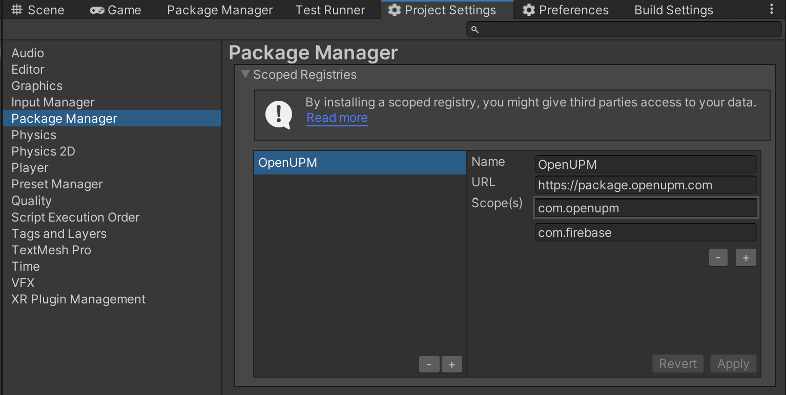

# Firebase.Storage

[](https://discord.gg/xQgMW9ufN4)
[](https://openupm.com/packages/com.firebase.storage/)

A [Firebase](https://firebase.google.com/) Storage package for the [Unity](https://unity.com/) Game Engine.

Based on [FirebaseStorage.net](https://github.com/step-up-labs/firebase-storage-dotnet)

## Installing

### Via Unity Package Manager and OpenUPM

- Open your Unity project settings
- Add the OpenUPM package registry:
  - `Name: OpenUPM`
  - `URL: https://package.openupm.com`
  - `Scope(s):`
    - `com.firebase`



- Open the Unity Package Manager window
- Change the Registry from Unity to `My Registries`
- Add the `Firebase.Storage` package

### Via Unity Package Manager and Git url

- Open your Unity Package Manager
- Add package from git url: `https://github.com/RageAgainstThePixel/com.firebase.storage.git#upm`

## Getting Started

```csharp
// Create a firebase authentication client
var firebaseClient = new FirebaseAuthenticationClient();

// Create a firebase storage client
var firebaseStorageClient = new FirebaseStorageClient(firebaseClient);

// Sign the user in
await firebaseClient.SignInWithEmailAndPasswordAsync(email, password);

// Get a reference to the resource using a path.
var resource = firebaseStorageClient.Resource("root/test.json");

var json = "{\"value\":\"42\"}";

string downloadUrl;

using (var stream = new MemoryStream(Encoding.UTF8.GetBytes(json)))
{
    // Upload content to storage
    downloadUrl = await resource.UploadAsync(stream, new Progress<FirebaseStorageProgress>(progress => Debug.Log(progress.Percentage)));
}

// Get content public download url (doesn't require authentication)
var knownUrl = await resource.GetDownloadUrlAsync();

Assert.IsTrue(downloadUrl == knownUrl);

// Download content
var httpClient = new HttpClient();
var response = await httpClient.GetAsync(knownUrl);
var responseData = await response.Content.ReadAsStringAsync();
Assert.IsTrue(responseData == json);

// Delete storage content
await resource.DeleteAsync();
```

## Additional Packages

- [Firebase.Authentication](https://github.com/RageAgainstThePixel/com.firebase.authentication)
- [Firebase.Realtime-Database](https://github.com/RageAgainstThePixel/com.firebase.realtime-database)
